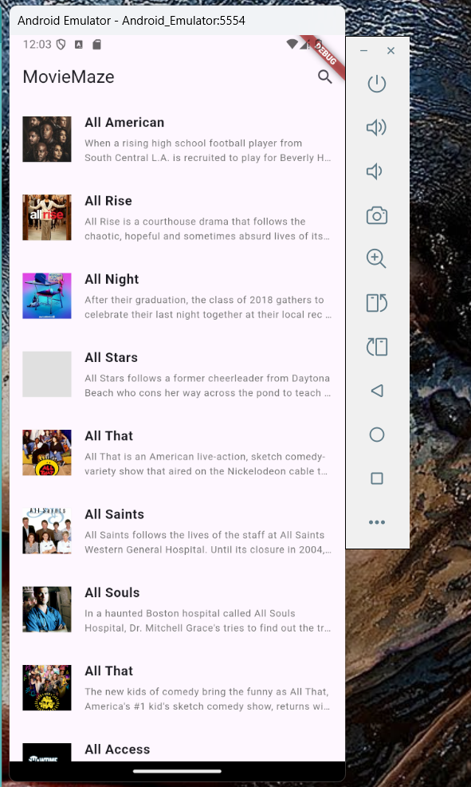
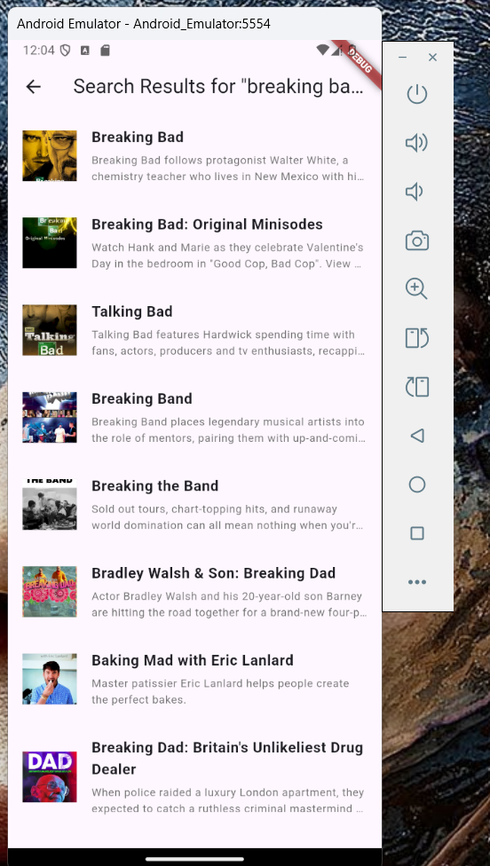
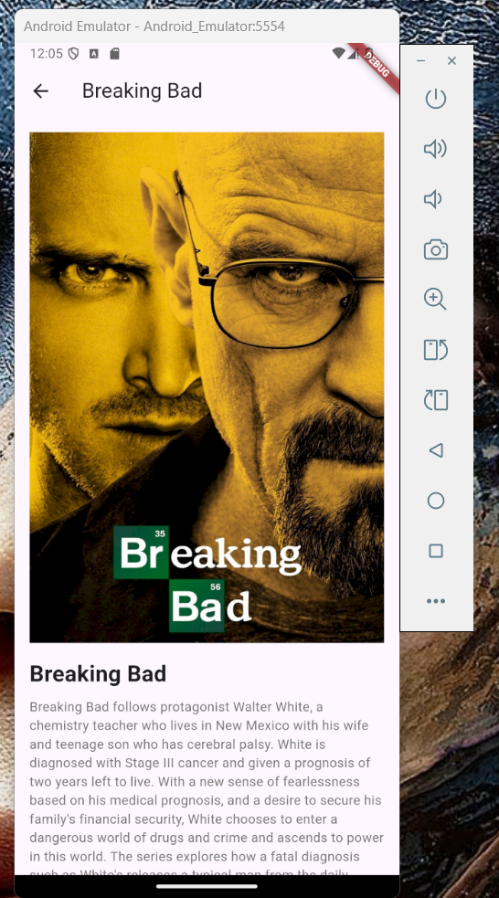

# MovieMaze Flutter App


MovieMaze is a [Flutter](https://flutter.dev/) application that allows users to browse and search for movies and TV shows using the [TVMaze API](https://api.tvmaze.com/search/shows?q=all). It provides a simple and user-friendly interface to display movie details, summaries, and images. The app features a home screen with a list of popular TV shows, a search feature to find specific shows, and a detailed screen for each movie/show.


## Features

**Home Screen**: Displays a list of popular TV shows with images and brief summaries.

**Search Functionality**: Allows users to search for TV shows and movies by name.

**Details Screen**: Provides detailed information about a selected TV show or movie, including its full summary and image.

**Responsive UI**: The app adapts well to various screen sizes, offering an intuitive design.

## Installation


To run the MovieMaze app on your local machine, follow these steps:

1. **Clone the repository**:

```
git clone https://github.com/yourusername/moviemaze-flutter.git
```
2. **Navigate to the project folder**:

```
cd moviemaze-flutter
```

3. **Install the dependencies**: If you're using Flutter, ensure you have Flutter SDK installed. Then run:

```
flutter pub get
```

4. **Run the app**: Ensure you have an emulator running or a device connected, and then:

```
flutter run
```

## Usage


### Home Screen
The Home Screen will display a list of TV shows fetched from the TVMaze API. Each item in the list shows the name, a short description, and an image (if available).
Clicking on any show’s name will take the user to the Details Screen for more information.



### Search Screen
To search for a specific TV show or movie, tap the search icon in the top right corner of the Home Screen. This opens the search bar where you can enter the name of the movie or show you're looking for.
The search results will be displayed on a new screen.



### Details Screen
Once you select a movie or TV show, the Details Screen provides detailed information, including a larger image and the full description.



### Project Structure


lib/
├── main.dart                   // Entry point of the application
├── screens/
│   ├── home_screen.dart        // Home screen displaying popular TV shows
│   ├── search_screen.dart      // Search screen for querying TV shows
│   └── details_screen.dart     // Details of a selected TV show or movie
├── movie_search_delegate.dart // Custom search delegate for searching movies


**main.dart**
The entry point of the application, where the app is initialized, and the routing between screens is set up.

**home_screen.dart**
This is the main screen that displays a list of TV shows fetched from the TVMaze API. It includes a search button that opens the search functionality.

**search_screen.dart**
A screen dedicated to displaying search results based on user input. It fetches data from the TVMaze API and displays results accordingly.

**details_screen.dart**
Displays the detailed information for a selected TV show, including its image and summary.

**movie_search_delegate.dart**
This file handles the custom search logic for the app, allowing users to search for shows within the app.

## Dependencies


**http**: For making HTTP requests to the TVMaze API to fetch movie data.

**flutter/material.dart**: For the UI components and widgets of the app.

**html/parser.dart**: For parsing HTML and stripping out unnecessary tags from the TVMaze API response.


## How It Works


1. **Fetching Movies**: The app makes an HTTP GET request to the TVMaze API to fetch a list of TV shows. The data is parsed and displayed in a list on the Home Screen.

2. **Search Functionality**: The search feature allows users to input a search term, which is sent to the TVMaze API to fetch the relevant search results.

3. **Displaying Details**: When a user taps on a movie or show in the list, the app navigates to the Details Screen, where detailed information about the selected show is displayed.